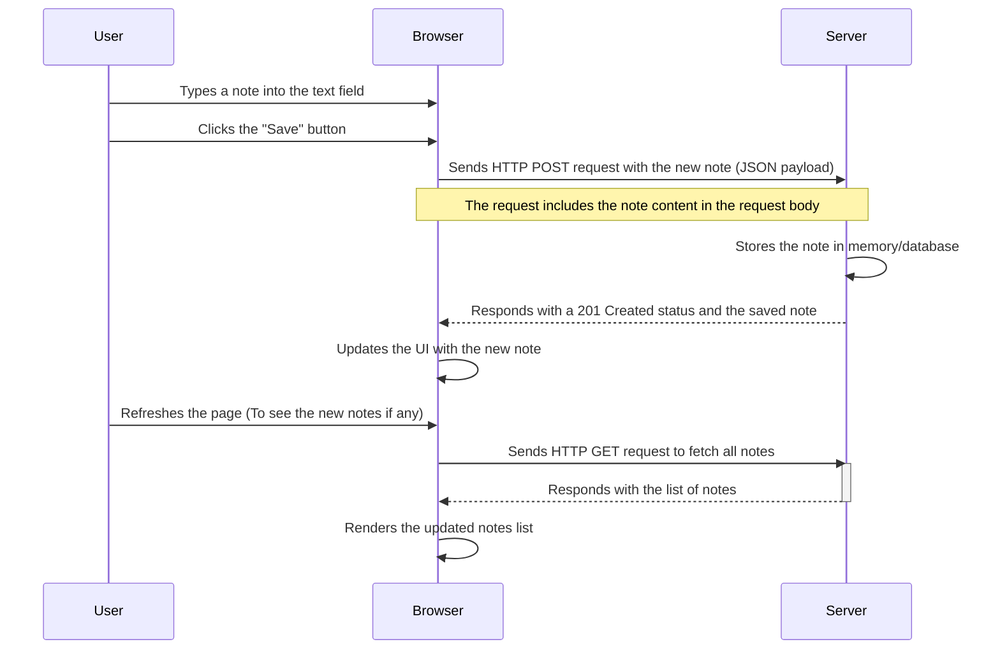

```mermaid

sequenceDiagram
    participant User
    participant Browser
    participant Server
    
    User->>Browser: Types a note into the text field
    User->>Browser: Clicks the "Save" button
    
    Browser->>Server: Sends HTTP POST request with the new note (JSON payload)
    note over Browser,Server: The request includes the note content in the request body
    
    Server->>Server: Stores the note in memory/database
    Server-->>Browser: Responds with a 201 Created status and the saved note
    
    Browser->>Browser: Updates the UI with the new note
    
    User->>Browser: Refreshes the page (To see the new notes if any)
    Browser->>Server: Sends HTTP GET request to fetch all notes
    activate Server
    Server-->>Browser: Responds with the list of notes
    deactivate Server
    Browser->>Browser: Renders the updated notes list
```
