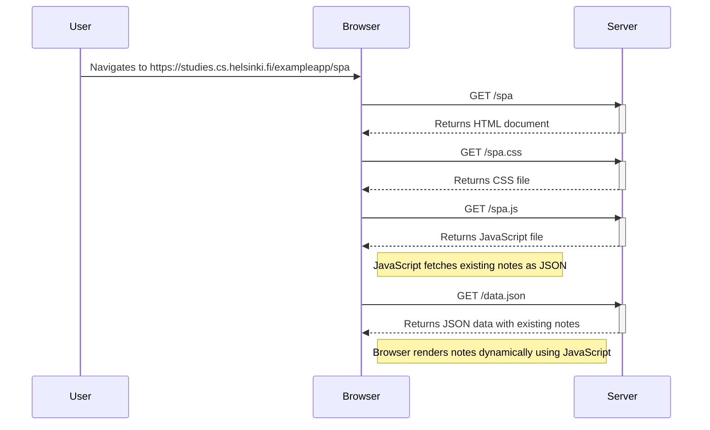

```mermaid
sequenceDiagram
    participant User
    participant Browser
    participant Server
    
    User->>Browser: Navigates to https://studies.cs.helsinki.fi/exampleapp/spa
    Browser->>Server: GET /spa
    activate Server
    Server-->>Browser: Returns HTML document
    deactivate Server
    
    Browser->>Server: GET /spa.css
    activate Server
    Server-->>Browser: Returns CSS file
    deactivate Server
    
    Browser->>Server: GET /spa.js
    activate Server
    Server-->>Browser: Returns JavaScript file
    deactivate Server
    
    note right of Browser: JavaScript fetches existing notes as JSON
    
    Browser->>Server: GET /data.json
    activate Server
    Server-->>Browser: Returns JSON data with existing notes
    deactivate Server
    
    note right of Browser: Browser renders notes dynamically using JavaScript
```
