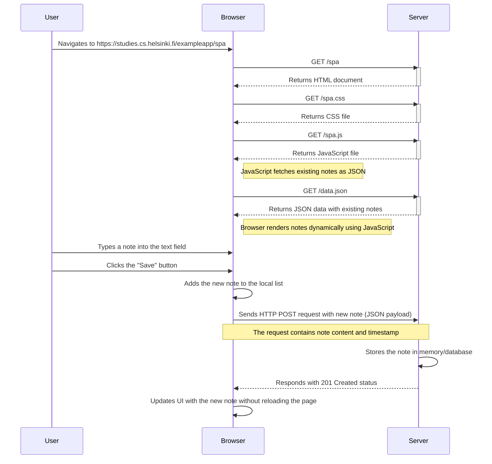

```mermaid
sequenceDiagram
    participant User
    participant Browser
    participant Server
    
    User->>Browser: Navigates to https://studies.cs.helsinki.fi/exampleapp/spa
    Browser->>Server: GET /spa
    activate Server
    Server-->>Browser: Returns HTML document
    deactivate Server
    
    Browser->>Server: GET /spa.css
    activate Server
    Server-->>Browser: Returns CSS file
    deactivate Server
    
    Browser->>Server: GET /spa.js
    activate Server
    Server-->>Browser: Returns JavaScript file
    deactivate Server
    
    note right of Browser: JavaScript fetches existing notes as JSON
    
    Browser->>Server: GET /data.json
    activate Server
    Server-->>Browser: Returns JSON data with existing notes
    deactivate Server
    
    note right of Browser: Browser renders notes dynamically using JavaScript
    
    User->>Browser: Types a note into the text field
    User->>Browser: Clicks the "Save" button
    
    Browser->>Browser: Adds the new note to the local list
    Browser->>Server: Sends HTTP POST request with new note (JSON payload)
    note over Browser,Server: The request contains note content and timestamp
    
    Server->>Server: Stores the note in memory/database
    Server-->>Browser: Responds with 201 Created status
    
    Browser->>Browser: Updates UI with the new note without reloading the page
```
